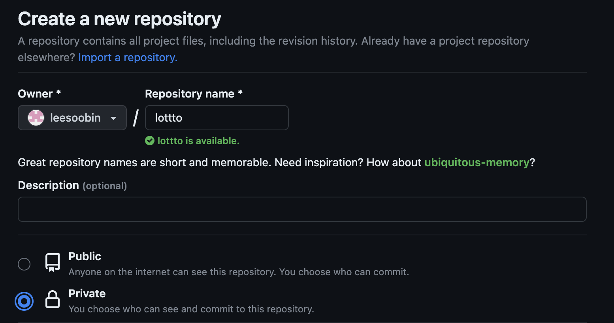
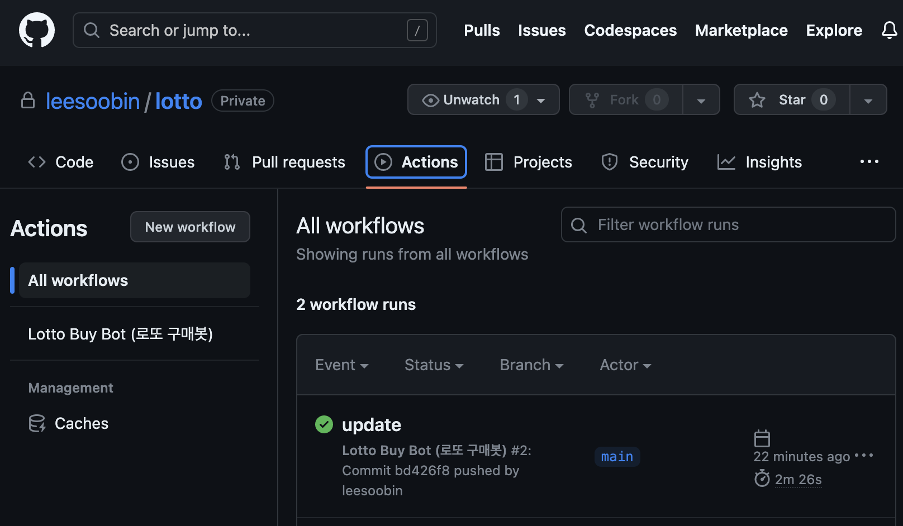
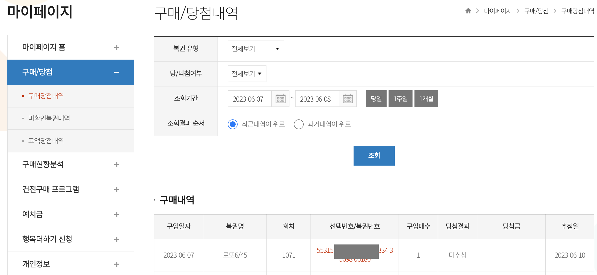

## 👋 소개

Github Action으로 로또 자동구매 해보자 🙌<br>

**🔵 순서** <br>
- 1 로또 가입 및 예치금 충전
- 2 github private 저장소를 생성
- 3 github Action 코드 작성
- 4 Python 자동구매 코드 작성
- 5 github에 push 
***

### ⌨️ 1. 로또 가입 및 예치금 충전
 > https://dhlottery.co.kr/
 > 회원가입 후 마이페이지 -> 예치금 -> 충전하기 1만원 충전
***

### ⌨️ 2. github private 저장소를 생성
> https://github.com/ -> repository -> new<br>
> ID,PW를 입력해야해서 `Private`모드로 설정해야 함<br>

***

### ⌨️ 3. github Action 코드 작성
 > workflows에 `action.yml`이 있어야만 Github Actions가 동작 합니다<br>
 > `on` 을 `[push]`로 하면 즉시, `[schedule-cron]`으로 하면 매주 토요일 8:55분에 자동 구매
```bash
/
├── .github
│   └── workflows
│       └── action.yml
├── README.md
└── buy_lotto.py
```
 > action.yml 코드
```bash
name: Lotto Buy Bot (로또 구매봇)

#on: [push] # 주석을 풀면 바로 구매가 됨
on:
  schedule:
    - cron: '55 23 * * 5' # UST 기준의 크론. UST 23:55 는 KST 08:55

jobs:
  build:
    runs-on: ubuntu-latest
    strategy:
      matrix:
        python-version: [3.7]

    steps:
    - uses: actions/checkout@v2
    - name: Set up python ${{ matrix.python-version }}
      uses: actions/setup-python@v1
      with:
        python-version: ${{ matrix.python-version }}
    
    - name: Install python package
      run: |        
        pip install selenium
        pip install requests        
        pip install twython
        pip install pillow    
        pip install gspread        
        pip install --upgrade google-api-python-client oauth2client
        pip install playwright
        python -m playwright install ${{ matrix.browser-channel }} --with-deps
    
    - name: Install ubuntu package
      run: |        
        sudo apt-get install fonts-unfonts-core
        sudo apt-get install fonts-unfonts-extra
        wget -q -O - https://dl-ssl.google.com/linux/linux_signing_key.pub | sudo apt-key add        
        sudo apt-get install google-chrome-stable    
        wget https://chromedriver.storage.googleapis.com/100.0.4896.20/chromedriver_linux64.zip
        unzip ./chromedriver_linux64.zip           
      
    - name: Run!      
      run: |        
        python ./buy_lotto.py
```
***

### ⌨️ 4. Python 자동구매 코드 작성
 > - `수정1`, `수정2`에 아이디,패스워드를 수정한다 <br>
```python
from playwright.sync_api import Playwright, sync_playwright
import time

# 동행복권 아이디와 패스워드를 설정
USER_ID = '<아이디>' #수정1
USER_PW = '<비밀번호>' #수정2

# 구매 개수를 설정
COUNT = 1

def run(playwright: Playwright) -> None:

    # chrome 브라우저를 실행
    browser = playwright.chromium.launch(headless=True)
    context = browser.new_context()

    # Open new page
    page = context.new_page()

    # Go to https://dhlottery.co.kr/user.do?method=login
    page.goto("https://dhlottery.co.kr/user.do?method=login")

    # Click [placeholder="아이디"]
    page.click("[placeholder=\"아이디\"]")

    # Fill [placeholder="아이디"]
    page.fill("[placeholder=\"아이디\"]", USER_ID)

    # Press Tab
    page.press("[placeholder=\"아이디\"]", "Tab")

    # Fill [placeholder="비밀번호"]
    page.fill("[placeholder=\"비밀번호\"]", USER_PW)

    # Press Tab
    page.press("[placeholder=\"비밀번호\"]", "Tab")

    # Press Enter
    # with page.expect_navigation(url="https://ol.dhlottery.co.kr/olotto/game/game645.do"):
    with page.expect_navigation():
        page.press("form[name=\"jform\"] >> text=로그인", "Enter")
    
    time.sleep(5)
    
    page.goto(url="https://ol.dhlottery.co.kr/olotto/game/game645.do")    
    # "비정상적인 방법으로 접속하였습니다. 정상적인 PC 환경에서 접속하여 주시기 바랍니다." 우회하기
    page.locator("#popupLayerAlert").get_by_role("button", name="확인").click()
    print(page.content())

    # Click text=자동번호발급
    page.click("text=자동번호발급")
    #page.click('#num2 >> text=자동번호발급')

    # 구매할 개수를 선택
    # Select 1
    page.select_option("select", str(COUNT))

    # Click text=확인
    page.click("text=확인")

    # Click input:has-text("구매하기")
    page.click("input:has-text(\"구매하기\")")

    time.sleep(2)
    # Click text=확인 취소 >> input[type="button"]
    page.click("text=확인 취소 >> input[type=\"button\"]")

    # Click input[name="closeLayer"]
    page.click("input[name=\"closeLayer\"]")
    # assert page.url == "https://el.dhlottery.co.kr/game/TotalGame.jsp?LottoId=LO40"

    # ---------------------
    context.close()
    browser.close()

with sync_playwright() as playwright:
    run(playwright)
```
***

### ⌨️ 5. github에 push
 > 수정한 소스코드를 github에 push 한다<br>
```bash
git add .
git commit -m "update"
git push origin main
```
 > github -> actions가 정상적으로 실행된걸 확인<br>

 > 마이페이지 -> 구매/당첨 -> 구매당첨내역 확인<br>

***

 

### 참고사이트
> https://velog.io/@king/githubactions-lotto<br>

```toc

```