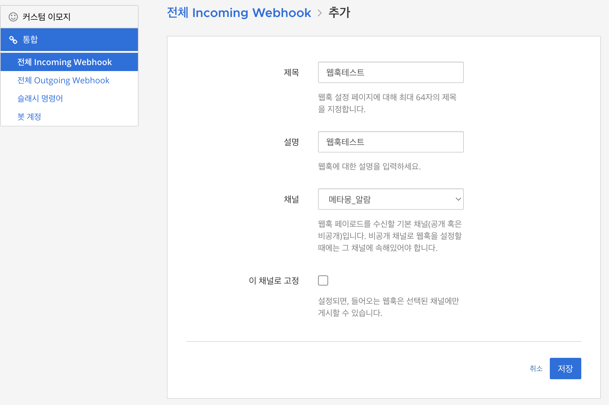
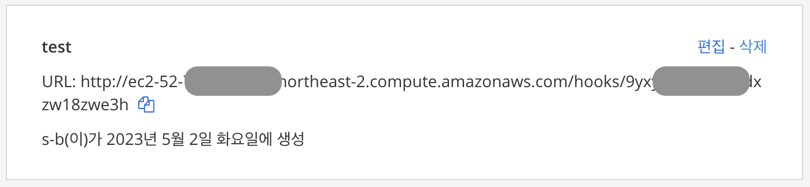
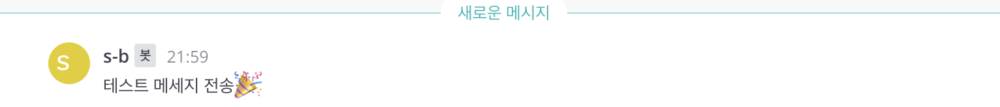

## 👋 소개
Incoming WebHook - 외부에서 메타모스트의 특정 채널로 메시지를 보내는 웹훅 만들기
***
### ⌨️ 1. incomming webhook 설정
> 사전에 챗봇이 메세지를 전송할 수 있는 채널을 만들어 놔야 함 <br>
> 메뉴순서 : 더보기 -> 통합(integration) -> incomming webhook -> incomming webhook 만들기

> 아래와 같이 url이 만들어지면 완성이다

***
### ⌨️ 2. curl로 메세지 보내보내기
> 위에 만들어진 url에 아래와 같이 메세지를 보내 본다
```bash
curl -i -X POST -H 'Content-Type: application/json' -d '{"text": "테스트 메세지 전송🎉"}' https://your-mattermost-server.com/hooks/xxx-generatedkey-xxx
```
> 아래와 같이 메세지가 정상 수신되면 완료

***
### 참고사이트
> https://developers.mattermost.com/integrate/webhooks/incoming/


```toc

```