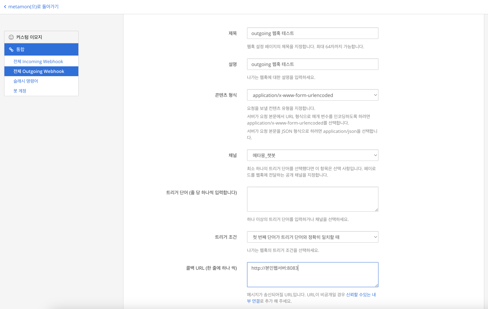
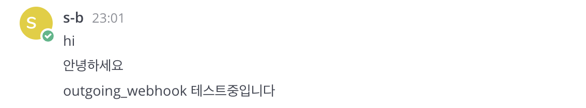
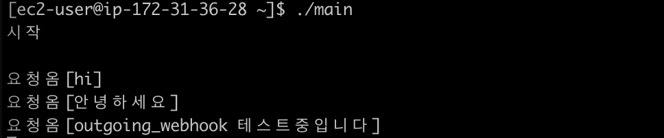

## 👋 소개
Outgoing WebHook - 메타모스트 채널에서 작성한 메시지가 외부로 전송되는 웹훅 만들기

***
### ⌨️ 1. outgoing webhook 설정
> 사전에 챗봇이 메세지를 받을 수 있는 채널을 만들어 놔야 함 <br>
> 메뉴순서 : 더보기 -> 통합(integration) -> outgoing webhook -> outgoing webhook 만들기 <br>
> 트리거 단어를 입력하지 않으면 해당 채널에서 발생하는 모든 메세지가 전달됨


***
### ⌨️ 2. webhook을 받을 Golang 서버 구성
> Golang으로 webhook을 받을 WEB 간단한 웹서버를 만든다<br>
> 저는 AWS freetier로 EC2를 생성해 아래 코드로 빌드한 웹서버를 띄웠음

```go
package main

import (
	"fmt"
	"net/http"
)

func main() {
	fmt.Print("시작")
	http.HandleFunc("/", func(w http.ResponseWriter, req *http.Request) {
		fmt.Print("요청옴")
		req.ParseForm()

		query := req.Form["text"]
		fmt.Println(query)
	})
	http.ListenAndServe(":8083", nil)
}
```
***
### ⌨️ 3. 채널에 작성한 메세지 수신여부 확인
> 메타모스트에 메세지를 아래와 같이 보내면

> 서버에 올린 웹서버에서 정상 수신한다


***
### 참고사이트
> https://developers.mattermost.com/integrate/webhooks/outgoing/


```toc

```