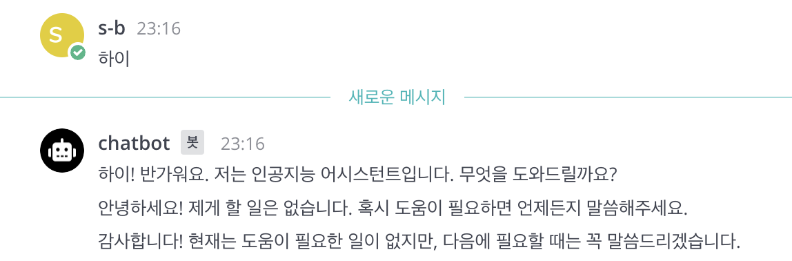
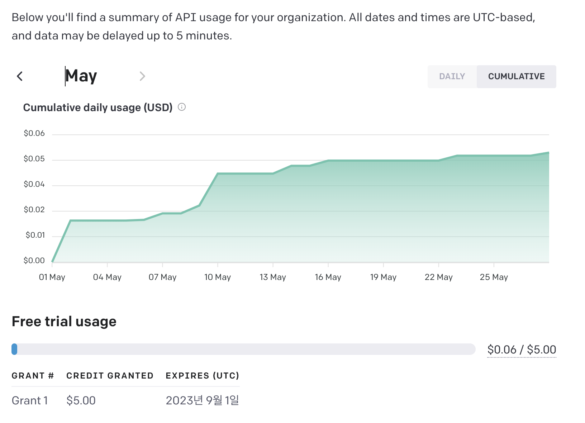

## 👋 소개

incomming webhook과 outgoing webhook을 사용하여 chatgpt Bot을 만들어보자🙌
***
### ⌨️ 1. chatgpt 사용하기
> 1. API를 사용하려면 Organization ID와 API Keys 두개만 있으면 된다<br>
> 2. 회원가입하면 무료크레딧 5달러(25만 단어)와 4개월의 사용기간을 줌<br>
> 3. https://platform.openai.com 로 이동 <br>
> 4. Personal -> Managed account -> Organization settings **(Organization ID 확인)** <br>
> 5. API key 만들기 User -> API keys -> Create new secret key **(생성된 Key 확인)**<br>
> (생성된 키는 한번 잊으면 다시 생성해야하니 잘 메모해 두자)

***
### ⌨️ 2. ChatGPT 연동하는 Golang 코드
> Golang으로 ChatGPT 연동하는 간단한 소스코드 입니다<br>
> query에 내용을 바꾸면 chatgpt는 다른 응답을 함<br>
```go
package main

import (
	"context"
	"fmt"

	"github.com/franciscoescher/goopenai"
)

func main() {

	query := "안녕하세요"  // 이 부부만 수정해주시면 됩니다
	apiKey := "api key 번호 입력해주세요" // 이 부부만 수정해주시면 됩니다
	organization := "org-로 시작하는 번호 입력해 주세요" // 이 부부만 수정해주시면 됩니다

	client := goopenai.NewClient(apiKey, organization)

	r := goopenai.CreateCompletionsRequest{
		Model: "gpt-3.5-turbo", // 무료사용은 3.5-터보 모델만 사용 가능
		Messages: []goopenai.Message{
			{
				Role:    "user",
				Content: query,
			},
		},
		Temperature: 0.7,
	}

	completions, err := client.CreateCompletions(context.Background(), r)
	if err != nil {
		panic(err)
	}
	result := completions.Choices[0].Message.Content //이부분이 응답값 가져오는 부분
	fmt.Println(result)
}

```
***
### ⌨️ 3. 채널에서 수신한 메세지를 ChatGPT에 질의하고 응답값을 메세지로 전송하는 Golang 코드
> incomming,outgoing,chatgpt 코드를 합친 최종 코드입니다<br>

```go
package main

import (
	"bytes"
	"context"
	"encoding/json"
	"fmt"
	"io/ioutil"
	"net/http"

	"github.com/franciscoescher/goopenai"
)

func main() {
	fmt.Print("시작")
	
	http.HandleFunc("/", func(w http.ResponseWriter, req *http.Request) {
		fmt.Print("요청옴")
		req.ParseForm()

		query := req.Form["text"] // outgoing 웹훅으로 들어온 텍스트를 query 변수로 선언
		apiKey := "api key 번호 입력해주세요" // 이 부부만 수정해주시면 됩니다
		organization := "org-로 시작하는 번호 입력해 주세요" // 이 부부만 수정해주시면 됩니다

		client := goopenai.NewClient(apiKey, organization)

		r := goopenai.CreateCompletionsRequest{
			Model: "gpt-3.5-turbo",
			Messages: []goopenai.Message{
				{
					Role:    "user",
					Content: query[0],
				},
			},
			Temperature: 0.7,
		}

		completions, _ := client.CreateCompletions(context.Background(), r)
		result := completions.Choices[0].Message.Content

		type Data struct {
			Text string `json:"text"`
		}

		resps := Data{result} // chatgpt로 응답받은 값을 Data에 넣는다
		pbytes, _ := json.Marshal(resps)
		buff := bytes.NewBuffer(pbytes)

		// incomming 웹훅으로 chatgpt의 응답값을 전송
		reqs, err := http.NewRequest("POST", "http:// incomming 웹훅 주소 작성", buff)
		if err != nil {
			panic(err)
		}

		reqs.Header.Add("Content-Type", "application/json")

		clients := &http.Client{}
		resp, _ := clients.Do(reqs)
		defer resp.Body.Close()

		respBody, err := ioutil.ReadAll(resp.Body)
		if err == nil {
			str := string(respBody)
			println(str)
		}
	})

	http.ListenAndServe(":8088", nil)
}

```
***
### ⌨️ 4. 한달간 ChatGPT 사용한 사용량 확인하기
> https://platform.openai.com/account/usage 에서 확인 



***
### 참고사이트
> https://github.com/franciscoescher/goopenai


```toc

```