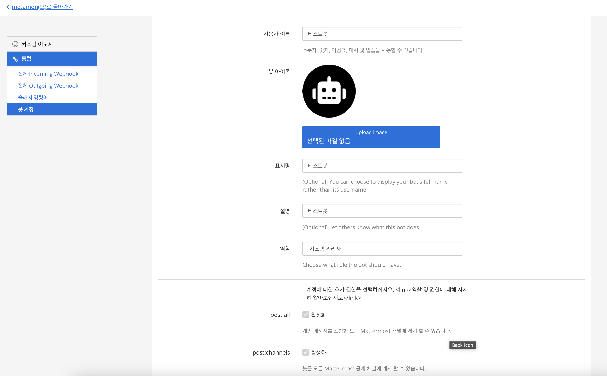

## 👋 소개

websocket을 사용하여 Bot을 만들어보자🙌
***
### ⌨️ 1. Mattermost Bot 만들기
> 메뉴순서 : 더보기 -> 통합(integration) -> Bot Account -> 봇 계정 만들기

***

### ⌨️ 2. Websocket 설정
> 1. 메타모스트 웹사이트에 로그인합니다.
> 2. 화면 상단의 ‘Tools’ 메뉴를 클릭합니다.
> 3. ‘Options’를 선택합니다.
> 4. 왼쪽 메뉴에서 ‘Server’를 선택합니다.
> 5. ‘Enable WebSocket server’ 옵션을 활성화합니다.
> 6. 웹소켓 서버 주소를 입력합니다. (예: wss://server.example.com)
> 7. ‘Save’ 버튼을 클릭합니다.

***
### ⌨️ 3. 봇 초기 설정 코드
> 먼저 관리자 도구 -> 사용자 -> 봇계정의 이메일과 패스워드를 세팅해주세요<br>
```go
const (
	SAMPLE_NAME       = "메타봇"
	MATTERMOST_ADDR   = "http://메타모스트 url"
	MATTERMOST_WSADDR = "ws://메타모스트 url"

	USER_EMAIL    = "봇계정@이메일"
	USER_PASSWORD = "패스워드 "
	USER_NAME     = "BOT"
	USER_FIRST    = "메타모스트"
	USER_LAST     = "봇"

	TEAM_NAME         = "metamon"
)
```

***
### ⌨️ 4. 응답 핸들러 코드
> 봇이 멤버로 들어가 있는 채널만 메세지가 수신됩니다<br>
```go
for {	//클라이언트 연결
		webSocketClient, err := model.NewWebSocketClient4(MATTERMOST_WSADDR, client.AuthToken)
		if err != nil {
			println("We failed to connect to the web socket")
			PrintError(err)
		}
		println("Connected to WS")
		webSocketClient.Listen() //웹소켓 실시간 listen

		for resp := range webSocketClient.EventChannel {
			HandleWebSocketResponse(resp) // 채널의 이벤트를 for문을 통해 수신
		}
	}
```

***
### ⌨️ 5. 채널 매세지 수신 및 메시지 전송
> 봇이 추가된 채널의 메세지를 정규표현식으로 분리하고 특정 단어에 따라 메세지를 응답하는 봇을 만든다<br>
```go
func HandleMsgFromDebuggingChannel(event *model.WebSocketEvent) {
	if event.EventType() != model.WEBSOCKET_EVENT_POSTED {
		return
	}
	post := model.PostFromJson(strings.NewReader(event.GetData()["post"].(string)))
	println("메세지수신 / 채널ID:", post.ChannelId, " / 메세지:", post.Message)
	if post != nil {
		if post.UserId == botUser.Id { //메세지의 userid가 봇의id와 같다면 무시하도록 설정
			return
		}
		if matched, _ := regexp.MatchString(`!날씨`, post.Message); matched {
			SendMsgToDebuggingChannel("오늘의 날씨는 구름많음 입니다", post.Id, post.ChannelId)
			return
		}
		if matched, _ := regexp.MatchString(`!온도`, post.Message); matched {
			SendMsgToDebuggingChannel("현재 온도는 23도 입니다", post.Id, post.ChannelId)
			return
		}
	}
}
```

***
### ⌨️ 6. 전체 코드
> 전체 코드 입니다 아래 펼치기를 눌러주세요<br>
<details markdown="1">
<summary>접기/펼치기</summary>

```go
package main

import (
	"os"
	"os/signal"
	"regexp"
	"strings"

	_ "github.com/go-sql-driver/mysql"

	"github.com/mattermost/mattermost-server/v5/model"
	_ "github.com/mattn/go-sqlite3"
)

const (
		SAMPLE_NAME       = "메타봇"
	MATTERMOST_ADDR   = "http://메타모스트 url"
	MATTERMOST_WSADDR = "ws://메타모스트 url"

	USER_EMAIL    = "봇계정@이메일"
	USER_PASSWORD = "패스워드 "
	USER_NAME     = "BOT"
	USER_FIRST    = "메타모스트"
	USER_LAST     = "봇"

	TEAM_NAME         = "metamon"
	CHANNEL_LOG_NAME  = "채널id1 - 채널에서 view info를 설정하면 channel id를 확인할수 있음"
	CHANNEL_LOG_NAME2 = "채널id2 - 채널에서 view info를 설정하면 channel id를 확인할수 있음"
)

var client *model.Client4
var webSocketClient *model.WebSocketClient
var files *model.FileUploadResponse
var botUser *model.User
var botTeam *model.Team
var debuggingChannel *model.Channel

// Documentation for the Go driver can be found
// at https://godoc.org/github.com/mattermost/platform/model#Client
func main() {

	println(SAMPLE_NAME)
	SetupGracefulShutdown()
	client = model.NewAPIv4Client(MATTERMOST_ADDR)
	MakeSureServerIsRunning()
	LoginAsTheBotUser()
	UpdateTheBotUserIfNeeded()
	FindBotTeam()
	SendMsgToDebuggingChannel(":smile:**`"+SAMPLE_NAME+"시작`**:smile:", "", CHANNEL_LOG_NAME)

	// Lets start listening to some channels via the websocket!
	for {
		webSocketClient, err := model.NewWebSocketClient4(MATTERMOST_WSADDR, client.AuthToken)
		if err != nil {
			println("We failed to connect to the web socket")
			PrintError(err)
		}
		println("Connected to WS")
		webSocketClient.Listen()

		for resp := range webSocketClient.EventChannel {
			HandleWebSocketResponse(resp)
		}
	}
}

func MakeSureServerIsRunning() {
	if props, resp := client.GetOldClientConfig(""); resp.Error != nil {
		println("There was a problem pinging the Mattermost server.  Are you sure it's running?")
		PrintError(resp.Error)
		os.Exit(1)
	} else {
		println("Server detected and is running version " + props["Version"])
	}
}

func LoginAsTheBotUser() {
	if user, resp := client.Login(USER_EMAIL, USER_PASSWORD); resp.Error != nil {
		println("There was a problem logging into the Mattermost server.  Are you sure ran the setup steps from the README.md?")
		PrintError(resp.Error)
		os.Exit(1)
	} else {
		botUser = user
	}
}

func UpdateTheBotUserIfNeeded() {
	if botUser.FirstName != USER_FIRST || botUser.LastName != USER_LAST || botUser.Username != USER_NAME {
		botUser.FirstName = USER_FIRST
		botUser.LastName = USER_LAST
		botUser.Username = USER_NAME

		if user, resp := client.UpdateUser(botUser); resp.Error != nil {
			println("We failed to update the Sample Bot user")
			PrintError(resp.Error)
			os.Exit(1)
		} else {
			botUser = user
			println("Looks like this might be the first run so we've updated the bots account settings")
		}
	}
}

func FindBotTeam() {
	if team, resp := client.GetTeamByName(TEAM_NAME, ""); resp.Error != nil {
		println("We failed to get the initial load")
		println("or we do not appear to be a member of the team '" + TEAM_NAME + "'")
		PrintError(resp.Error)
		os.Exit(1)
	} else {
		botTeam = team
	}
}

func CreateBotDebuggingChannelIfNeeded() {
	if rchannel, resp := client.GetChannelByName(CHANNEL_LOG_NAME, botTeam.Id, ""); resp.Error != nil {
		println("We failed to get the channels")
		PrintError(resp.Error)
	} else {
		debuggingChannel = rchannel
		return
	}

}

func SendMsgToDebuggingChannel(msg string, replyToId string, channelid string) {
	post := &model.Post{}
	post.ChannelId = channelid
	post.Message = msg

	//post.RootId = replyToId

	if _, resp := client.CreatePost(post); resp.Error != nil {
		println("We failed to send a message to the logging channel")
		PrintError(resp.Error)
	}
}

func HandleWebSocketResponse(event *model.WebSocketEvent) {
	HandleMsgFromDebuggingChannel(event)
}

func HandleMsgFromDebuggingChannel(event *model.WebSocketEvent) {
	defer func() {
		recover()

	}()

	if event.EventType() != model.WEBSOCKET_EVENT_POSTED {
		return
	}

	post := model.PostFromJson(strings.NewReader(event.GetData()["post"].(string)))
	println("메세지수신 / 채널ID:", post.ChannelId, " / 메세지:", post.Message)
	if post != nil {

		if post.UserId == botUser.Id {
			return
		}
		if matched, _ := regexp.MatchString(`!날씨`, post.Message); matched {
			SendMsgToDebuggingChannel("현재 날씨는 23도입니다", post.Id, post.ChannelId)
			return
		}

	}

}

func PrintError(err *model.AppError) {
	println("\tError Details:")
	println("\t\t" + err.Message)
	println("\t\t" + err.Id)
	println("\t\t" + err.DetailedError)
}

func SetupGracefulShutdown() {
	c := make(chan os.Signal, 1)
	signal.Notify(c, os.Interrupt)
	go func() {
		for _ = range c {
			if webSocketClient != nil {
				webSocketClient.Close()
			}
			SendMsgToDebuggingChannel(":disappointed_relieved:**`"+SAMPLE_NAME+"정지`**:disappointed_relieved:", "", CHANNEL_LOG_NAME)
			os.Exit(0)
		}
	}()
}

```

</details>

***
### 참고사이트
> https://github.com/mattermost/mattermost-bot-sample-golang/blob/master/bot_sample.go


```toc

```