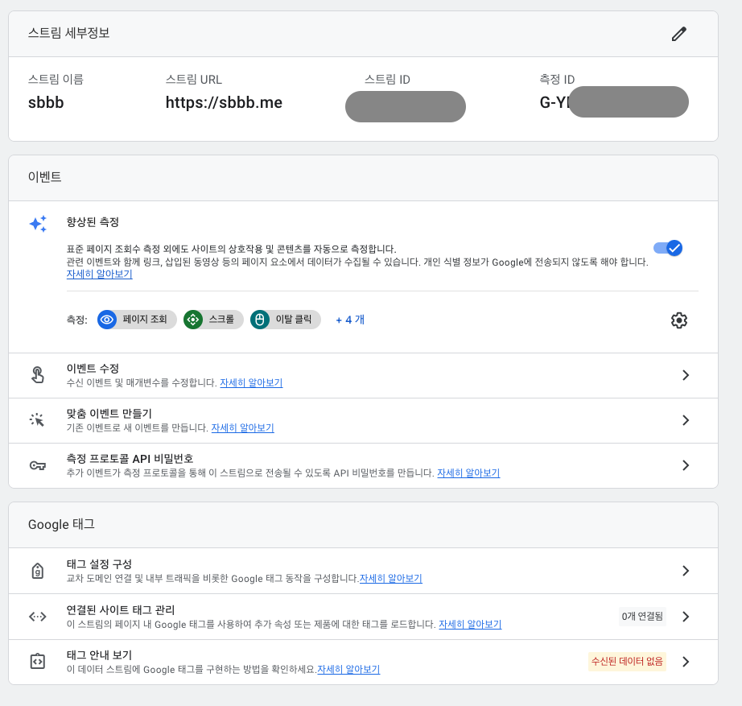

## 👋 소개

Gastby로 만든 Gitlab 블로그에 구글 애널리틱스를 붙여보자🙌
***
### ⌨️ 1. Google Analytics 가입하기
> https://analytics.google.com/<br>
> 사이트 `<head>` `</head>` 사이에 애널리틱스를 스크립트를 넣어야 검토가 완료됩니다 <br>
> 헤드에 스크립트만 잘들어가면 바로 구글 애널리틱스에 데이터가 수짐됨

***

### ⌨️ 2. Gastby에 Google Analytics plugin 설치 (<head>에 자동태그삽입)
> 플러그인을 설치하면 `<head>` 사이에 자동으로 구글애널리틱스 코드를 삽입해줌<br>
> 플러그인 설치 신규로 구글에널리틱스를 신청하면 gatsby-plugin-gtag가 아닌 <br>
> gatsby-plugin-gtag를 써야함 (버전이 다름)
```bash
npm install gatsby-plugin-gtag
```
> gatsby-config.js 에 설정 추가<br>
> 본인 trackingId 에널리틱스 홈-> G-로 시작하는 영문 값이 있음
```js
    {
      resolve: `gatsby-plugin-gtag`,
      options: {
          trackingId: `G-본인 trackingId`,
          head: true,
      },
    },
```

***
### ⌨️ 3. Google Analytics 데이터 수집 확인 
> Google Analytics 홈을 보면 사용자 1이 증가됨을 확인할 수 있음<br>


***
### 참고사이트
> https://www.gatsbyjs.com/plugins/gatsby-plugin-gtag/


```toc

```