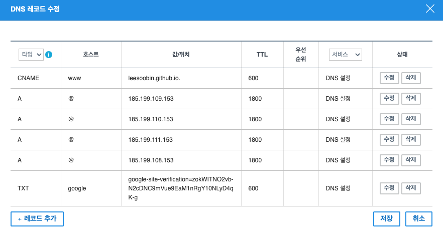
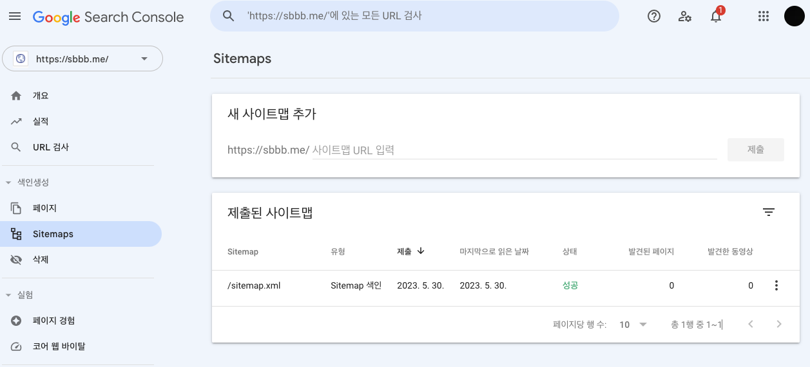

## 👋 소개

Gastby로 만든 Gitlab 블로그에 구글 검색에 나오게 해보자🙌
***
### ⌨️ 1. Google Search 가입하기
> https://search.google.com/search-console/about<br>
> DNS레코드 추가해야 넘어갈수 있음 아래참고
***

### ⌨️ 2. Gabia DNS 레코드 추가 
> 가비아 -> 도메인관리 -> DNS정보 -> DNS 레코드 설정 -> 설정 -> 레코드 수정 <br>
> DNS 타입 : TXT , 호스트 : google, 값 : 구글서치콘솔에서 받은 값 추가 <br>




***
### ⌨️ 3. Google Search Console sitemap 제출
> Google Search Console 개요을 검색 내역을 확인 할 수 있음<br>
> 바로는 안되는듯 함 시간이 좀 걸리나 봄<br>
> 우선 색인생성 -> Sitemaps 에 sitemap 제출 (Gatsby는 자동으로 sitemap이 생성됨)<br>


***
### 참고사이트
> https://www.gatsbyjs.com/plugins/gatsby-plugin-gtag/


```toc

```