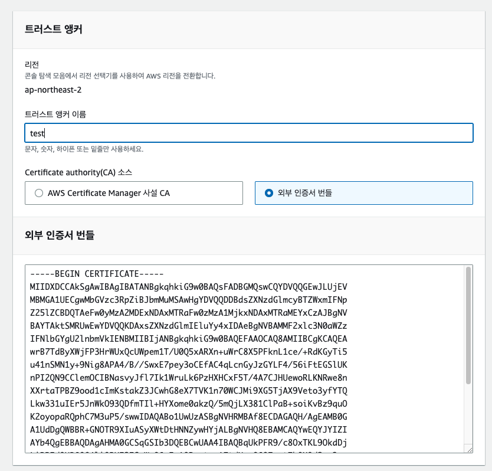

## 👋 소개

awscli를 Roles Anywhere를 통해서 접속 해보자🙌
- 1 RootCA 인증서 만들기 (CA Bundle 인증서) - **1편**
- 2 SSL 인증서 만들기 (RootCA로 서명한 aws접속용 인증서) - **1편**
- 3 CA Bundle 등록(trust-anchor) - **2편**
- 4 role 생성 - **2편**
- 5 profile 생성 - **2편**
- 6 aws_credential_helper로 credentials 생성 - **2편**
- 7 aws cli 설치 및 명령어 사용 해보기 - **2편**
- 8 EC2에 SSM Agent 설치 - **3편**
- 9 PC에 SSM plugin 설치후 aws cli로 EC2접속 - **3편**

***
### ⌨️ 3. CA Bundle 등록(trust-anchor)
 AWS -> 서비스 검색 -> Roles Anywhere -> 트러스트 앵커 생성 <br>
> 앵커이름 : test <br>
> Certificate authority(CA) 소스 : 외부 인증서 번들 <br>
> 외부 인증서 번들에는 1편에서 만든 lesstif-rootca.pem 파일 내용 복사 <br>
> test 트러스트 앵커의 세부정보에 `트러스트 앵커 ARN` 내용 복사해두기 <br>
> ex ) arn:aws:rolesanywhere:ap-northeast-2:testt123:trust-anchor/64438eff-ea71-449 <br>


***

### ⌨️ 4. role 생성
 AWS -> 서비스 검색 -> Roles Anywhere -> 설정 단계 -> 역할 구성 -> 새 역할 생성  <br>
> 신뢰할수 있는 엔티티 유형 : AWS 서비스 <br>
> 다른 AWS 서비스의 사용사례 : Roles Anywhere -> 다음<br>
> 신뢰 할수 있는 엔티티 선택  내용에 아래와 같이 Condition 추가  <br>
>  "aws:SourceArn" 은 위에 트러스트 앵커의 arn 복붙 <br>

```bash
{
    "Version": "2012-10-17",
    "Statement": [
        {
            "Effect": "Allow",
            "Principal": {
                "Service": "rolesanywhere.amazonaws.com"
            },
            "Action": [
                "sts:AssumeRole",
                "sts:SetSourceIdentity",
                "sts:TagSession"
            ],
            "Condition": {
                "ArnEquals": {
                    "aws:SourceArn": "arn:aws:rolesanywhere:ap-northeast-2:testtestte:trust-anchor/test-ea71-test-test-test"
                }
            }
        }
    ]
}
```
>  생성 이후 `롤의 ARN` 복붙 <br>
***

### ⌨️ 5. profile 생성
 AWS -> 서비스 검색 -> Roles Anywhere -> 프로파일 생성 <br>
> 프로파일 이름 : test <br>
> 역할은 4번에서 만든 test 로 선택 <br>
> 나머지는 수정없이 프로파일 생성 <br>
>  생성 이후 `프로파일의 ARN` 복붙 <br>

***

### ⌨️ 6. aws_credential_helper로 credentials 생성
> https://docs.aws.amazon.com/rolesanywhere/latest/userguide/credential-helper.html 
> 본인이 사용하는 OS 별로 다운로드
> 아래와 내용 복사해서 쳐보기 (* 인증서와 키 경로는 full path를 쳐야함)

```bash
# 2,3번 라인은 2편 RootCA로 서명한 aws접속용 crt,key파일 경로
# 4,5,6번 라인은 위에서 만든 ARN 3개 trust-anchor,profile,role를 넣기  

./aws_signing_helper credential-process \
      --certificate /path/to/certificate \ 
      --private-key /path/to/private-key \ 
      --trust-anchor-arn arn:aws:rolesanywhere:region:account:trust-anchor/TA_ID \
      --profile-arn arn:aws:rolesanywhere:region:account:profile/PROFILE_ID \
      --role-arn arn:aws:iam::account:role/role-name-with-path

# 입력해서 성공하면 아래처럼 나옴 
{"Version":1,"AccessKeyId":"ASIAXNQ~~~~~CYZL","SecretAccessKey":"N7LWW~~~~~~~igU6PR67dFylHSHoAt",
"SessionToken":"IQoJb3JpZ2luX2VjEIf//////////wEaDmFwLW5vcnRoZWFzdC0yIkgwRgIhAOwy+O9Tz+x7FfztORGHC03BLE4E
+vclwgP830gUmQt6AiEAtIq+vgzKNQhlC2o9bXsyWZuKqzbJoEXr4oKYP9qMrq8qvwMIwf//////////
ARADGgw1MTAwODczNjU2OTAiDI4vmdEDEQ/nThQwWSqTAxkMG2/
4bhgxXPy73aQxj49fujBbx5FLZmp57Ufl461J0UCGgAIKo1m7nyKm8YQZ6vIcz3uG1BJFSKg78IABKkjzUbSkr2bM/zap
+Ykk66R9SnoPao75j0t1fkShwoqqy8JAg20r7ikLRt3yLXXLLVP6UY~}
```
***

### ⌨️ 7. aws cli 설치 및 명령어 사용 해보기
> https://docs.aws.amazon.com/ko_kr/cli/latest/userguide/getting-started-install.html
> 본인에게 해당되는 OS로 설치
> MacOS는 terminal 에서 aws 명령어 쳐러 아래처럼 나오면 성공
```bash 
usage: aws [options] <command> <subcommand> [<subcommand> ...] [parameters]
To see help text, you can run:

  aws help
  aws <command> help
  aws <command> <subcommand> help

aws: error: the following arguments are required: command
```
***

### ⌨️ 8. aws cli로 ec2 정보 가져와보기

```bash
aws ec2 describe-instances
```
***

### 참고사이트
> hhttps://docs.aws.amazon.com/rolesanywhere/latest/userguide/credential-helper.html<br>
> https://docs.aws.amazon.com/ko_kr/cli/latest/userguide/getting-started-install.html


```toc

```