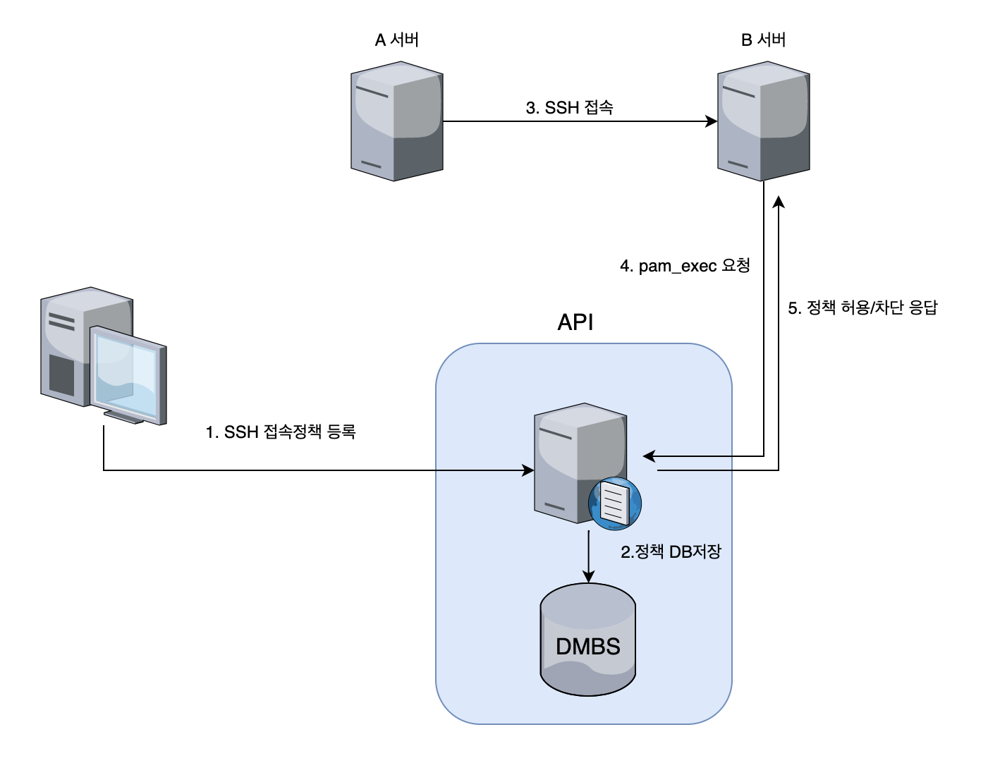

## 👋 소개

SSH 접근을 중앙에서 관리해 보자🙌
- 1 pam 설정
- 2 (client)api 요청 쉘파일 설정
- 3 (server)api 응답 서버 코드
- 4 ssh 중앙관리 플로우

***
### ⌨️ 1. pam 설정
> pam(Pluggable Authentication Module)은 사용 권한을 제어하는 모듈이다<br>
> - 1번째 인자 `session`은 sshd 세션을 열었을때 옵션이다 <br>
> - 2번째 인자 `required` - 해당 설정으로 진행 시 실패하면 인증을 거부한다 <br>
> - 2번째 인자 `optional` - 해당 설정으로 진행 시 실패해도 인증은 성공한다 <br>
> - 3번째 인자 `pam_exec.so` 는 내가 지정한 파일을 실행시키는 옵션이다 <br>
> - 4번째 인자 `/etc/ssh.sh` 는 내가 지정한 파일의 경로이다 <br>
> /etc/pam.d/sshd 설정 <br>
```bash
vi /etc/pam.d/sshd
# 맨마지막 줄에 아래 옵션을 추가한다 (잘못설정하면 영영 ssh접근이안되니.. 테스트는 optional로)
session optional pam_exec.so /etc/ssh.sh

```

***

### ⌨️ 2. /etc/ssh.sh api 설정
 > exit code `0`은 정상 종료, exit code `1`은 에러 비정상종료 <br>
 > - `$PAM_RHOST`는 접근시도한 Remote 호스트<br>
 > - `$PAM_USER`는 접근하려는 User 값을 받아올수있다 <br>
```bash
# api로 로그인 성공 api 호출
vi /etc/ssh.sh


#!/bin/bash
STATUS=$(curl -o /dev/null -w "%{http_code}" "http://localhost:8089/api1/$PAM_RHOST/$PAM_USER")

if [ $STATUS -eq 200 ]; then
  echo "로그인 성공"
  exit 0
else
  echo "로그인 실패"
  exit 1
fi
```
***
### ⌨️ 3. api 서버 코드
 > **api 1**은 response code `200`, **api 2**는 response code `400`을 준다<br>
```go
package main

import (
	"log"
	"net/http"
)

func main() {
	http.HandleFunc("/api1", index1)
	http.HandleFunc("/api2", index2)
	log.Fatal(http.ListenAndServe(":8089", nil))
}

func index1(w http.ResponseWriter, r *http.Request) {
    sourceip := strings.Split(r.RemoteAddr, ":")[0]
    fmt.Print("Source IP ",sourceip)
    fmt.Print("Destination IP ",r.URL.Path[2:])
    fmt.Print("사용자",r.URL.Path[3:])
	w.WriteHeader(200)
	w.Write([]byte(http.StatusText(200)))
	return
}

func index2(w http.ResponseWriter, r *http.Request) {
    sourceip := strings.Split(r.RemoteAddr, ":")[0]
    fmt.Print("Source IP ",sourceip)
    fmt.Print("Destination IP ",r.URL.Path[2:])
    fmt.Print("사용자",r.URL.Path[3:])
	w.WriteHeader(400)
	w.Write([]byte(http.StatusText(400)))
	return
}

```
***
### ⌨️ 4. ssh 중앙관리 플로우
 > 사용자는 미리 ssh 중앙관리 서버에 source,dest IP를 api서버에 정책으로 넣어두고 <br>
 > source와 dest IP가 DB에 있으면 `200`을 리턴해서 접근성공 <br>
 > source와 dest IP가 DB에 없으면 `400`을 리턴해서 접근실패<br>
 > 아래 플로우로 SSH 중앙관리를 할 수 있다<br>

 

### 참고사이트
> https://wariua.github.io/linux-pam-docs-ko/sag-pam_exec.html

```toc

```