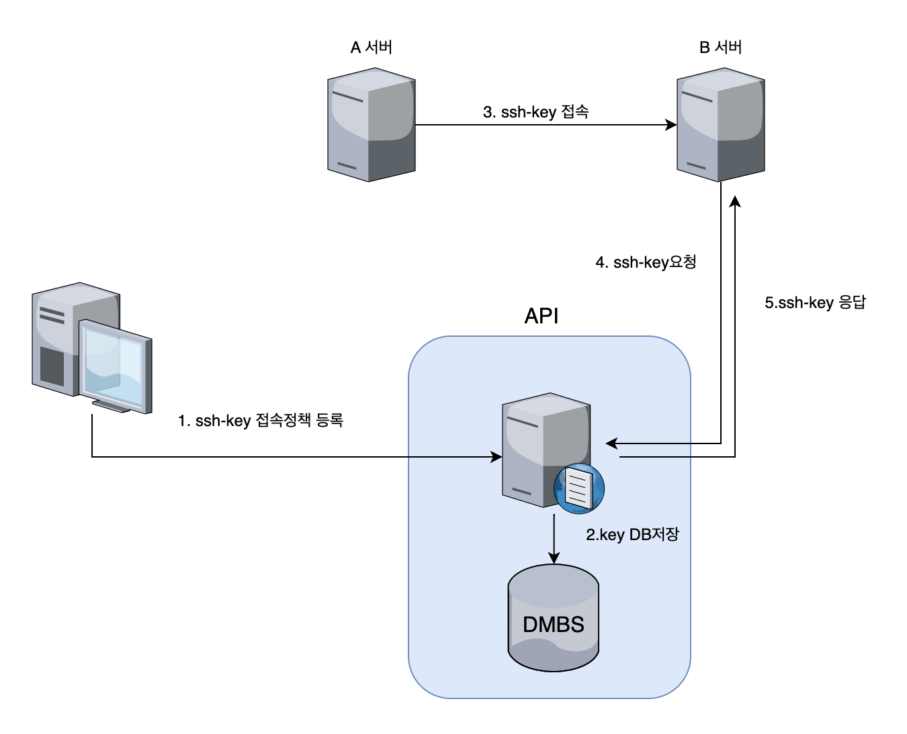

## 👋 소개

SSH-KEY 접근을 중앙에서 관리해 보자🙌
- 1 sshd_config 설정
- 2 (client)api 요청 쉘스크립트 파일
- 3 (server)api 응답 서버 코드
- 4 ssh-key 중앙관리 플로우

***
### ⌨️ 1. sshd_config 설정
> /etc/ssh/sshd_conifg 설정 <br>
> 설정은 아래 config에서 2개만 수정하면 된다<br>
```bash
vi /etc/ssh/sshd_config
# ssh-key로 접근시 api_key 파일을 실행하도록 설정한다
AuthorizedKeysCommand /usr/sbin/api_key

# AuthorizedKeysFile은 root권한만 수정이 가능한 디렉토리로 변경한다 
AuthorizedKeysFile /root/.ssh/authorized_keys

```
***

### ⌨️ 2. /usr/sbin/api_key 쉘 스크립트 파일
 > api를 호출하여 ssh-key를 받아온다 <br>
 > - 변수`$1`은 접근시도한 계정명을 가져올수 있다<br>

```bash
# sh-key api 호출
vi /etc/sbin/api_key

#!/bin/bash

curl http://localhost:8081/sshkey/$1
```
***

### ⌨️ 3. api 서버 코드
 > 간단하게 ssh-key만 리턴하는 코드임<br>
```go
package main

import (
	"fmt"
	"log"
	"net/http"
)

func main() {
	http.HandleFunc("/sshkey", index)
	log.Fatal(http.ListenAndServe("8081", nil))

}

func index(w http.ResponseWriter, r *http.Request) {
	fmt.Fprint(w, "ssh-rsa AAAAB3NzaC1y~~ ec2-user@ip-172-31-00-00.ap-northeast-2.compute.internal")
	fmt.Print(r.URL.Path[1:]) // 계정명 
}


```
***
### ⌨️ 4. ssh-key 중앙관리 플로우
 > 사용자는 미리 ssh 중앙관리 서버에 `srcIP`,`dstIP`,`ssh-key`,`계정` 4가지를  정책으로 넣어두고 <br>
 > source와 dest IP,접근하는 계정이 DB에 있으면 `200, ssh-key`를 리턴해서 접근은 **성공**한다<br>
 > source와 dest IP,접근하는 계정이 DB에 없으면 `400`을 리턴해고 ssh-key접근을 **실패**한다<br>
 > 아래 플로우로 SSH-KEY를 중앙관리를 할 수 있다<br>

 

### 참고사이트
> https://www.popit.kr/ssh-key-%ED%9A%A8%EC%9C%A8%EC%A0%81%EC%9D%B8-%EA%B4%80%EB%A6%AC-%EB%B0%A9%EB%B2%95/

```toc

```