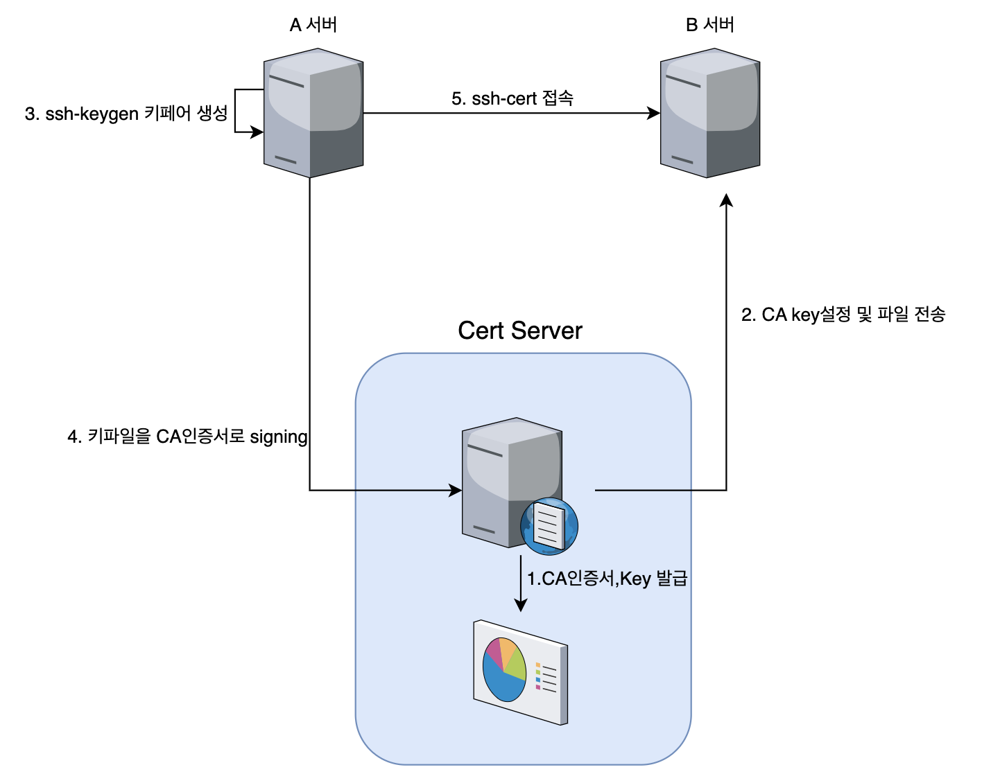

## 👋 소개

SSH-CERT 접근을 중앙에서 관리해 보자🙌<br>

**🔵 SSH-KEY 보다 SSH-CERT를 사용해야하는 4가지** <br>
- 1 프로비저닝하거나 `프로비저닝 해제할 필요`가 없음
- 2 인증서는 실제로 `단 한 줄`의 코드로 구현하기가 매우 간단함
- 3 수명이 짧고 자체 파괴적이므로 자동으로 `기한 만료`됨
- 4 key는 사용자가 생성 및 관리를 하지만 cert는 `CISO가 관리`를 할 수 있음
**🔴 많은 기업들이 SSH-KEY를 사용하지 않는 이유 3가지** <br>
- 1 `잘못된 PR` : 조직에서 인증서를 사용하도록 하는 데 충분한 추진력이 없음
- (Facebook, Uber, Netflix, Lyft 등이 SSH 인증서를 채택했지만 좋은 PR은 아직 나오지 않음)
- 2 `PKI 지식 필요` : 이 작업을 수행하려면 약간의 PKI 지식이 필요
- 3 `인프라 설정 필요` : SSH 인증서는 생각보다 어렵지 않지만 먼저 일부 구성을 수행해야 함
**🟡 순서** <br>
- 1 ssh-keygen으로 CA인증서 생성`(중앙서버)`
- 2 sshd_config 설정 및 키파일 전송`(목적지서버)`
- 3 ssh-keygen으로 sign받을 키페어 생성 `(출발지서버)`
- 4 CA인증서로 키페어 sign`(중앙서버)`
- 5 sign된 키로 목적지 서버에 ssh 접속`(출발지서버)`
- 6 ssh-cert 중앙관리 플로우
***

### ⌨️ 1. ssh-keygen으로 CA인증서 생성(중앙서버)
```bash
#passphrase는 없이 생성한다
ssh-keygen -f client_ca
# client_ca, client_ca.pub 파일이 생성된다
```
***

### ⌨️ 2. sshd_config 설정 및 키파일 전송(목적지서버)
> /etc/ssh/sshd_conifg 설정 <br>
> 설정 이후 sshd 서비스 재시작 필요<br>
> `이 키로부터 사인된 인증서로 접근하는 클라이언트라면 SSH 접근을 허용한다`라는 의미임 <br>
```bash
vi /etc/ssh/sshd_config
# 중앙서버에서 생성한 client_ca.pub 파일을 목적지 서버로 가져와서 세팅한다
TrustedUserCAKeys /etc/ssh/client_ca.pub

```
***

### ⌨️ 3. ssh-keygen으로 sign받을 키페어 생성 (출발지서버)
```bash
#passphrase는 없이 생성한다
ssh-keygen
# id_rsa, id_rsa.pub 파일이 생성된다
```
***

### ⌨️ 4. CA인증서로 키페어 sign(중앙서버)
 > 출발지 서버에서 id_rsa.pub 파일을 가져온다 <br>
 > 기존에 만든 client_ca인증서로 sign을 한다 <br>
 > - 옵션 -n : 계정명 <br>
 > - 옵션 -V : 사용기간 <br>
```bash
ssh-keygen -s client_ca -I user_identifier -n root -V +5m id_rsa.pub
#  id_rsa-cert.pub 파일이 생성된다
```
***

### ⌨️ 5. sign된 키로 목적지 서버에 ssh 접속(출발지서버)
 > 중앙서버에서 발급한 id_rsa-cert.pub키를 ~/.ssh/id_rsa-cert.pub 로 위치시킨다<br>
```bash
ssh 계정명@목적지서버
#접속성공
```
***

### ⌨️ 6. ssh-cert 중앙관리 플로우
 > 보안 담당자는 는 미리 ssh-cert 중앙관리 서버에 `CA인증서`를 생성해둔다 <br>
 > 인프라 담당자는 미리 모든 서버에 `CA키`, `TrustedUserCAKeys` 세팅해 논다<br>
 > 사용자는 ssh접속이 필요할경우 `키페어`를 생성해 `signing요청`을 하고 ssh접속을 한다<br>

 

### 참고사이트
> https://www.devseccon.com/blog/3-reasons-to-use-ssh-certificates-instead-of-ssh-keys-secadvent-day-22<br>
> https://blog.naver.com/alice_k106/221803861645

```toc

```